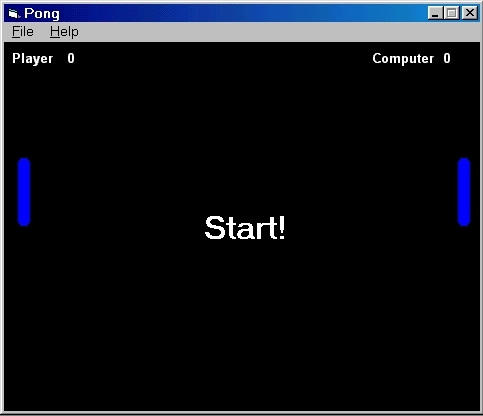



## Pong Type Game\.\.

### Description

This is a game of Pong, as part of my exercises, the code for moving the ball and paddles, was downloaded from this very site, but I`ve modified it and added a scoring system to the game, I also tried adding sound, but I was unsuccessful with the Path, but everything else, came out good... Although I still have a few more ideas for this game, prefect for a beginner, to learn a little code, Menu bars, Forms... Enjoy!
 
### More Info
 

             |
---                |---
**Submitted On**   |2002-02-12 23:34:54
**By**             |[Lee Foy](https://github.com/Planet-Source-Code/PSCIndex/blob/master/ByAuthor/lee-foy.md)
**Level**          |Beginner
**User Rating**    |5.0 (10 globes from 2 users)
**Compatibility**  |VB 6\.0
**Category**       |[Games](https://github.com/Planet-Source-Code/PSCIndex/blob/master/ByCategory/games__1-38.md)
**World**          |[Visual Basic](https://github.com/Planet-Source-Code/PSCIndex/blob/master/ByWorld/visual-basic.md)
**Archive File**   |[Pong\_Type\_549342122002\.zip](https://github.com/Planet-Source-Code/lee-foy-pong-type-game__1-31703/archive/master.zip)

